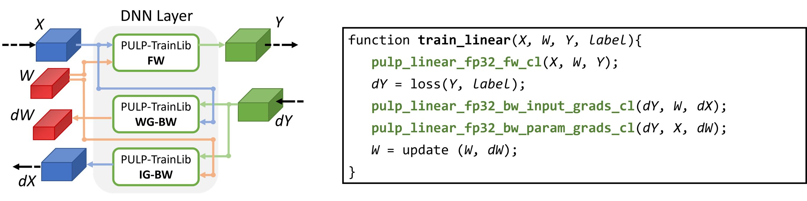
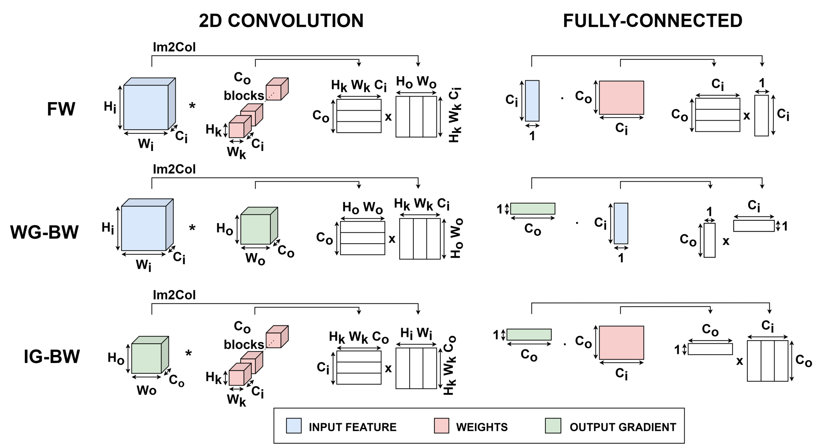
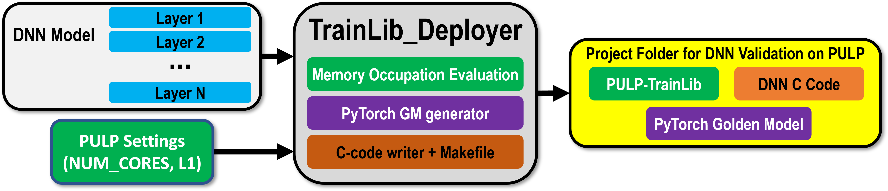
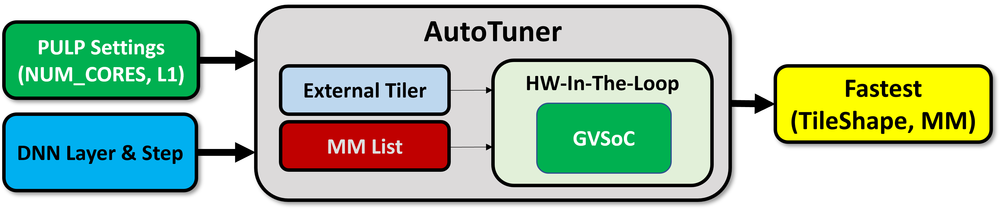

# PULP-TrainLib

PULP-TrainLib is the first Deep Neural Network (DNN) training library for multi-core RISC-V MCUs (as PULP), enabling On-Device Learning on ultra-low-power devices of this class.

PULP-TrainLib features a variety of training primitives and support functions to enable backpropagation-based training on multicore MCUs. More in depth:

- A set of performance-tunable DNN layer primitives for training, based on Matrix Multiplication (MM). 
- Commonly used loss functions, like MSE and CrossEntropy. 
- SGD-based optimizers.
- Activation (ReLU, etc) and support functions.

[PULP-TrainLib](./lib/) is fully released as open-source under [Apache License Version 2.0](./LICENSE).

To ease the deployment of DNN training tasks on MCUs, PULP-TrainLib is equipped with additional tools:

- [TrainLib_Deployer](./tools/TrainLib_Deployer/), an automated code-generation tool to generate the C code to validate and train a user-specified DNN model on a PULP architecture. 
- [AutoTuner](./tools/AutoTuner/), a pre-deployment tool to select the fastest configuration of each layer of a DNN model, according to the shapes of the layer, the training step and the tiling strategy.

If you use any part of PULP-TrainLib , please cite:
```
@InProceedings{10.1007/978-3-031-15074-6_13,
author="Nadalini, Davide
and Rusci, Manuele
and Tagliavini, Giuseppe
and Ravaglia, Leonardo
and Benini, Luca
and Conti, Francesco",
editor="Orailoglu, Alex
and Reichenbach, Marc
and Jung, Matthias",
title="PULP-TrainLib: Enabling On-Device Training for RISC-V Multi-core MCUs Through Performance-Driven Autotuning",
booktitle="Embedded Computer Systems: Architectures, Modeling, and Simulation",
year="2022",
publisher="Springer International Publishing",
address="Cham",
pages="200--216",
abstract="An open challenge in making Internet-of-Things sensor nodes ``smart'' and self-adaptive is to enable on-chip Deep Neural Network (DNN) training on Ultra-Low-Power (ULP) microcontroller units (MCUs). To this aim, we present a framework, based on PULP-TrainLib, to deploy DNN training tasks on RISC-V-based Parallel-ULP (PULP) MCUs. PULP-TrainLib is a library of parallel software DNN primitives enabling the execution of forward and backward steps on PULP MCUs. To optimize PULP-TrainLib's kernels, we propose a strategy to automatically select and configure (autotune) the fastest among a set of tiling options and optimized floating-point matrix multiplication kernels, according to the tensor shapes of every DNN layer. Results on an 8-core RISC-V MCU show that our auto-tuned primitives improve MAC/clk by up to 2.4{\$}{\$}{\backslash}times {\$}{\$}{\texttimes}compared to ``one-size-fits-all'' matrix multiplication, achieving up to 4.39 MAC/clk - 36.6{\$}{\$}{\backslash}times {\$}{\$}{\texttimes}better than a commercial STM32L4 MCU executing the same DNN layer training workload. Furthermore, our strategy proves to be 30.7{\$}{\$}{\backslash}times {\$}{\$}{\texttimes}faster than AIfES, a state-of-the-art training library for MCUs, while training a complete TinyML model.",
isbn="978-3-031-15074-6"
}
```

This repository is released under the [Apache License Version 2.0](./LICENSE).

## PULP-TrainLib's training library

PULP-TrainLib is the first open-source training library for RISC-V-based multicore MCUs, including a set of performance-tunable DNN layer primitives to enable DNN training on ultra-low-power devices. The training flow of PULP-TrainLib's primitives follows the canonic approach for the backpropagation algorithm, currently considering a streaming approach (batch size = 1). I.e., first we compute the Forward (FW) step to compute the prediction for a given input data. Then, a Backward Step is called to compute, layer-by-layer, the gradient of the loss function with respect to the weights (WG-BW) and the gradient of the loss function with respect to the input (IG-BW). The structure of the training flow of a single layer (e.g. a Fully-Connected) is depicted as follows:



Note that every training step for most of the layers is implemented as a Matrix Multiplication (MM) between tensor data. E.g., for a Conv2D and Fully-Connected Layer, the structure and sizes of the involved matrices can be represented as follows:



Convolutions are implemented as Image-to-Column (or Image-to-Row) pre-processed data + MM. The sizes of the tensors are denoted as (CI, HI, WI) for the input feature map, (CO, CI, Hk, Wk) for the weights, and (CO, HO, WO) for the output feature map. To tune the performances of the training primitives, specific optimizations can be selected case-by-case for the MM algorithm. 


## The TrainLib_Deployer

The development of C code for running On-Device Learning can be a time-consuming process. To make deployment easier, PULP-TrainLib provides TrainLib_Deployer, a code generation tool which creates all the necessary files to run DNN validation and training on a [PULP](https://pulp-platform.org/)-based MCU. To minimize the memory occupation, the TrainLib_Deployer adopts a data-reuse approach to store tensors in C arrays. The flow of the TrainLib_Deployer is illustrated as follows:



The input arguments of the TrainLib_Deployer are the architecture of the model to be trained on an MCU and the setup (memory and number of cores) of the target device. Indeed, the tool assumes to run an On-Device Learning routine on an MCU equipped with N parallel cores for computation. While running, the tool takes care of verifying if the model fits the memory. As output, the tool generates a project folder containing the code to run a verification task of the target DNN model on the target device (PyTorch Golden Model, or GM, C code, Makefile). 


## PULP-TrainLib's AutoTuner

PULP-TrainLib optimizes the core computational kernel of DNN training primitives - the Matrix Multiplication (or MM) - with various unrolling and parallelization schemes. To select the best optimization for a given training step and tile size, PULP-TrainLib provides an Autotuner, which exhaustively searches for the fastest kernel among the [library of available optimized MM kernels](lib/include/pulp_matmul_fp32.h). AutoTuner's flow can be represented as follows:



Given the properties of the target device and the layer/training step informations on a generic layer (e.g. 8 cores, 64kB, Conv2D, Forward), AutoTuner exhaustively searches for the fastest tile shape which best fits the specified memory amount and the fastest MM kernel which minimizes the latency on the given tile shape. For further info, readers may refer to "PULP-TrainLib: Enabling On-Device Training for RISC-V Multi-Core MCUs through Performance-Driven Autotuning" [SAMOS Pre-Print Version](https://www.samos-conference.com/Resources_Samos_Websites/Proceedings_Repository_SAMOS/2022/Papers/Paper_14.pdf).


# Repository overview

PULP-TrainLib's library files are located under the `lib/` folder ([lib's README](lib/README.md)).

The `tests/` folder provides useful tests to try out and verify PULP-TrainLib's layers and functions (tests are performed with respecto to a PyTorch Golden models).
Each test can be customized according to the user specifications and profiles the execution of the layer's primitives with PULP's performance counters.
If further info are needed, please refer to the [test's README](tests/README.md).

The `tools/` folder contains useful tools which ease the usage of PULP-TrainLib, as the TrainLib_Deployer and AutoTuner. For further info, please refer to [tools' README](tools/README.md).

The `assets/` folder contains useful support files for PULP-TrainLib. Inside [CI_test_suite](assets/CI_test_suite/), users can find a testing environment that can be used to verify PULP-TrainLib's primitives for Continuous Integration (TO BE COMPLETED). 


# Tutorials

To learn how to generate the code with our TrainLib_Deployer and more details about the optimizations used in this library, a [tutorial repository](https://github.com/dnadalini/PULP-TrainLib-Tutorial) is available online. This repository contains tutorials and a guide to easily install a conda environment with all the necessary requirements to run PULP-TrainLib.


# Installation and requirements

## PULP-SDK

PULP-TrainLib requires [PULP-SDK](https://github.com/pulp-platform/pulp-sdk) and the [RISC-V GNU GCC TOOLCHAIN](https://github.com/pulp-platform/pulp-riscv-gnu-toolchain) to be used and compiled.
Please refer to the links to correctly setup your working environment.

## Python - PyTorch requirements

To successfully run the tests, Python (>= 3.6) is needed, together with PyTorch (>= 1.9.0). To install the dependencies (with CPU only), run:

```
python -m pip install argparse 
python -m pip install install torch torchvision torchaudio --index-url https://download.pytorch.org/whl/cpu
python -m pip install torchsummary
```

If you require the GPU (CUDA >= 10.2) version for your applications, instead run:

```
python -m pip install argparse 
python -m pip install torch torchvision torchaudio
python -m pip install torchsummary
```

The tests have been verified using torch version "1.9.0+cpu".


## PULP-TrainLib

To get started with PULP-TrainLib, just clone this repository on your local PC.

Before compiling any project, source `pulp-sdk/configs/pulp_open.sh` from the terminal from which you intend to compile your project. 
The `configs/` folder is located inside the path to your pulp-sdk directory.

When generating a DNN for PULP with the TrainLib Deployer, make sure to launch the python task from a terminal in which you did not source the `pulp_open.sh`.


# Testing and verification

To add new functionalities, users can follow the naming convention of PULP-TrainLib and provide [primitives](lib/) and a related test inside the `tests/` folder. For integrating the new features, we recommend to extend the [continuous integration test suite](assets/CI_test_suite/test_suite.py) to functionally verify the primitives before the integration.


# Branches

PULP-TrainLib's repository is organized with these branches:
- `main`: main branch, targeting PULP architectures.
- `trainlib-tutorial`: branch reserved for tutorial purposes (see [https://github.com/dnadalini/PULP-TrainLib-Tutorial](https://github.com/dnadalini/PULP-TrainLib-Tutorial)).
- `pulp-trainlib-paper`: branch to reproduce the results provided in the paper ["PULP-TrainLib: Enabling On-Device Training for RISC-V Multi-Core MCUs through Performance-Driven Autotuning"](https://www.samos-conference.com/Resources_Samos_Websites/Proceedings_Repository_SAMOS/2022/Papers/Paper_14.pdf).
- `pulp-trainlib-stm32`: this is a PULP-TrainLib port compatible with STM32 and other MCUs (FP32 format only).


# Available features status log

> Note: checked are complete, unchecked are ongoing/buggy

PULP-TrainLib:

- [X] Forward passes for DepthWise, PointWise Convolutions and Conv2D, Fully-Connected, Transposed Convolution 2D (FP32, FP16)
- [X] Weight gradients for DepthWise, PointWise Convolutions and Conv2D, Fully-Connected, Transposed Convolution 2D (FP32, FP16)
- [X] Input gradients for DepthWise, PointWise Convolutions and Conv2D, Fully-Connected, Transposed Convolution 2D (FP32, FP16)
- [X] CWH data layout for DepthWise, PointWise and 2D Convolutions, Transposed Convolution 2D (FP32, FP16)
- [X] HWC data layout for PointWise Convolution (FP32, FP16) and 2D Convolutions (FP32, FP16)
- [X] Stride and Padding (only naive 2D Convolutions, without im2col+mm optimization)
- [X] ReLU, Leaky ReLU, Sigmoid activation functions (FP32, FP16)
- [X] Gradient Descent optimizer (FP32, FP16)
- [X] L1Loss, MSE Loss, berHu Loss (FP32, FP16)
- [ ] CrossEntropyLoss (FP32, FP16)
- [X] Max and Average Pooling (FP32, FP16)
- [X] RNN training primitives (FP32)
- [X] Multihead Self Attention training primitives (FP32)
- [X] Residual connection (FP32, FP16)
- [X] InstanceNorm (FP32, FP16)
- [X] Biases for Conv2D (FP32, FP16) 
- [ ] Biases for Fully-Connected, Weight and Input grad steps (forward bugged) (FP32, FP16)
- [ ] Padding operators for DepthWise and 2D Convolution (im2col + mm)
- [ ] HWC data layout management for DepthWise Convolution (FP32, FP16)
- [ ] Stride operators for 2D Convolutions and DepthWise (im2col + mm)
- [ ] RNN training primitives (FP16)
- [ ] Multihead Self Attention training primitives (FP16)
- [ ] Biases for DepthWise and PointWise Convolutions (FP32, FP16)
- [ ] Sparse Update (layer-wise) in TrainLib_Deployer
- [ ] Partial Im2Col / Im2Row for Conv2D (FP32, FP16)

TrainLib_Deployer:

- [X] No Buffer and Single Buffer mode, supporting layer-wise execution (tiling not supported)
- [X] Conv2D, PointWise, DepthWise Convolutions, Fully-Connected support (FP32, FP16)
- [X] Average and Max Pooling (FP32, FP16)
- [X] ReLU, LeakyReLU, Sigmoid Activations (FP32, FP16)
- [X] InstanceNorm (FP32, FP16)
- [X] Residual Connections (FP32, FP16, only no buffer mode)
- [ ] Residual Connections (FP32, FP16, single buffer mode)
- [X] SGD Optimizer (FP32, FP16)
- [ ] FP32-FP16 Layer-Wise Mixed Precision Mode
- [X] Layer-Wise Sparse Update
- [X] CHW Data Layout
- [ ] HWC Data Layout
- [X] Online Learning (batch size = 1)
- [ ] Mini-Batch Learning (batch size > 1)

# Known bugs / issues (open for contributions)

- AutoTuner working with "NUM_TILING_SOLUTIONS = 1"
- Sporadic bugs in "mm_u2" in FP32 (mostly on leftovers)
- Performance bugs in im2col/im2row with DMA loading (performances tend to be less than im2col/im2row with cores)
- Missing integration for RNN / MHSE in TrainLib_Deployer
- FP32 MHSA primitives (Input Grad)
- Missing integration of sigmoid function in TrainLib_Deployer
- Performances of FP16 sigmoid may need to be optimized with FP16 exponenetial (e.g., https://github.com/0xBYTESHIFT/fp16/blob/master/include/half/half.hpp)

TrainLib_Deployer:
- Training does not converge in DNNs generated with TrainLib_Deployer if the last layer is not updated 
- With no single/double buffering, not updating a PW layer in a sparse update results in wrong backward computation


# Contributors

## Currently active

- Davide Nadalini (d.nadalini@unibo.it, davide.nadalini@polito.it)
- Alberto Dequino (alberto.dequino@unibo.it, alberto.dequino@polito.it)
- Manuele Rusci (manuele.rusci@kuleuven.be)
- Francesco Conti (f.conti@unibo.it)
- Cristian Cioflan (cioflanc@iis.ee.ethz.ch)
- Luca Bompani (luca.bompani5@unibo.it)
- Lan Mei (lanmei@student.ethz.ch)
- Calin Diaconu (calin.diaconu@studio.unibo.it)

## Past Contributors

- Giacomo Saporetti (giacomo.saporetti@studio.unibo.it)
- Francesco Conoscenti (francesco.conoscenti@studio.unibo.it)
- Leonardo Ravaglia (leonardo.ravaglia2@unibo.it)


# References

> D. Nadalini, M. Rusci, L. Benini, and F. Conti, "Reduced Precision Floating-Point Optimization for Deep Neural Network On-Device Learning on MicroControllers" [ArXiv Pre-Print](https://arxiv.org/abs/2305.19167)
> 
> D. Nadalini, M. Rusci, G. Tagliavini, L. Ravaglia, L. Benini, and F. Conti, "PULP-TrainLib: Enabling On-Device Training for RISC-V Multi-Core MCUs through Performance-Driven Autotuning" [SAMOS Pre-Print Version](https://www.samos-conference.com/Resources_Samos_Websites/Proceedings_Repository_SAMOS/2022/Papers/Paper_14.pdf), [Springer Published Version](https://link.springer.com/chapter/10.1007/978-3-031-15074-6_13)

